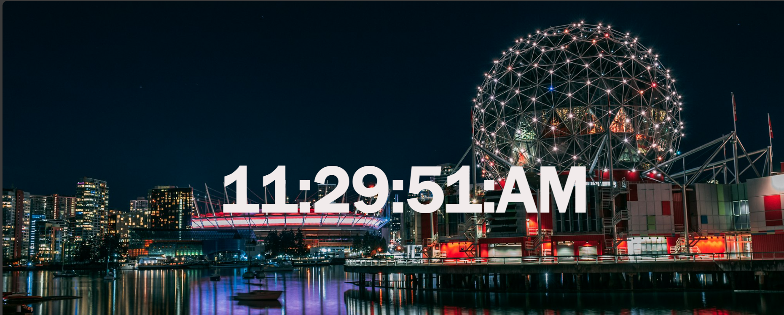

# Digital Clock ⏰

A simple digital clock built using HTML, CSS, and JavaScript.

## Features
- Real-time display
- AM/PM format
- Stylish and minimal design

## How to Run
- Open `index.html` in any modern browser

## Technologies
- HTML
- CSS
- JavaScript

## 📸 Demo
 

## Author
[FARWA KHALID]